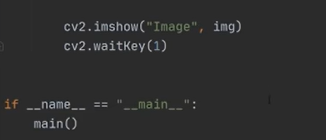

for hand trackig it uses 2 module in the backend one is **palm detection** and other is **hand landmarks**  
palm detection provide  cropped image of hand and find **21 hand landmark**  


the packages we need is  
**opencv**, **mediapipe**, along side with other preinstalled packages 

there is a bare minimum code for hand tracking :

```python
import cv2
import mediapipe as mp
import time
```

create video object as :

```python
cap = cv2.VideoCapture(0)
```

```python
while True:
    success, img = cap.read()
    cv2.imshow("image", img)
    cv2.waitKey(1)
```

we have to create an instance of mediapipe: 

```python
mpHands = mediapipe.solutions.hands
hands = mpHands.Hands()
```

there are different parameter we have to pass to that hands function:

- `static_image_mode` (True or False)
- `maximum number of hands`
- `minimum_detection_confidence`
- `minimum_tracking_confidence`

even if we don't pass the parameters it won't affect as in the backend function they are using the default parameters

we have to convert the image to rgb:

```python
imgRGB = cv2.cvtColor(img, cv2.COLOR_BGR2RGB)
results = hands.process(imgRGB)  # this does the processing of the frame and gives the result to us
```

now we have to handle the extraction of the results.

we have to extract the information from it.  
as we know in the parameter we have defined that we can have multiple hands, for that we have to use a for loop.  
but before we do that we have to make sure that there is something in results, so we can print the results.

```python
print(results.multi_hand_landmarks)
```

put it in condition as:

```python
if results.multi_hand_landmarks:
    for handLms in results.multi_hand_landmarks:
```

(now we have to draw line in between the points on the hand, like points, there are 21 points, so it will be quite a lot of maths, so mediapipe has provided method to do so)

```python
mpDraw = mp.solutions.drawing_utils
```

(this we have to initialize in the part of the code where we have initialized the hands variable and then use the `mpDraw` in the for loop)

```python
mpDraw.draw_landmarks(img, handLms)  # this will plot the points on the hands
mpDraw.draw_landmarks(img, handLms, mpHands.HAND_CONNECTIONS)  # this will connect those points
```

we have to write the fps as well  
so at the top we have to initialize the previous time as 0 and current time as 0

```python
previous_time = 0
current_time = 0
```

and in the while loop write:

```python
current_time = time.time()
fps = 1 / (current_time - previous_time)
previous_time = current_time
```

to display that fps we can use:

```python
cv2.putText(img, str(int(fps)), (10, 70), cv2.FONT_HERSHEY_PLAIN, 3, (255, 0, 255), 3)
```

**Extracting and using those values**:  
we will get the `id` number and the `landmark` information.  
the landmark information will give us the x and y coordinates and ids are already listed in correct order

```python
for id, lm in enumerate(handLms.landmark):
    print(id, lm)
```

(the coordinates we get are in decimal places, because they are **normalized values** – ratio of image width and height)

we need them in **pixel values**, so we multiply with width and height:

```python
height, width, channel = img.shape
cx, cy = int(lm.x * width), int(lm.y * height)
print(id, cx, cy)
```

to detect a landmark for a particular id  


**Output:**  


now we have to create a module out of this so that we can use it anywhere so that next time we don't have to write this all again.  
we can simply ask for a list of these 21 values and then we can simply say ok I need point number 10 – that will make it very easy for us for different applications.

create a module file and copy all the code and paste there  
and at the end write:

```python
if __name__ == "__main__": 
    main()
```

and club all the while loop and everything into the main function

we can use **class object approach**

```python
class handDetector():
    def __init__(self, mode=False, maxHands=2, detectionCon=0.5, trackCon=0.5):
        self.mode = mode
        self.maxHands = maxHands
        self.detectionCon = detectionCon
        self.trackCon = trackCon

        self.mpHands = mp.solutions.hands
        self.hands = self.mpHands.Hands(self.mode, self.maxHands, self.detectionCon, self.trackCon)
        self.mpDraw = mp.solutions.drawing_utils
```

```python
    def findHands(self, img, draw=True):    
        imgRGB = cv2.cvtColor(img, cv2.COLOR_BGR2RGB)
        self.results = self.hands.process(imgRGB)

        if self.results.multi_hand_landmarks:
            for handLms in self.results.multi_hand_landmarks:
                if draw:
                    self.mpDraw.draw_landmarks(img, handLms, self.mpHands.HAND_CONNECTIONS)
        return img
```


the main function should look like this:  
put a if check as `len(lmlist) != 0` before printing  
  


now to find the position we have to create a function as `findPosition`

```python
    def findPosition(self, img, handNO=0, draw=True):
        lmList = []
        if self.results.multi_hand_landmarks:
            myHand = self.results.multi_hand_landmarks[handNO]
            h, w, c = img.shape
            for id, lm in enumerate(myHand.landmark):
                cx, cy = int(lm.x * w), int(lm.y * h)
                lmList.append((id, cx, cy))
                if draw:
                    cv2.circle(img, (cx, cy), 7, (0, 255, 0), cv2.FILLED)
        return lmList
```


now it works as a module and we can use it in different modules of projects.  
for it, only copy the main function code and paste it in the other module and then import the `cv2` and other libs, and after that import the file which contains the whole class, and use it.
